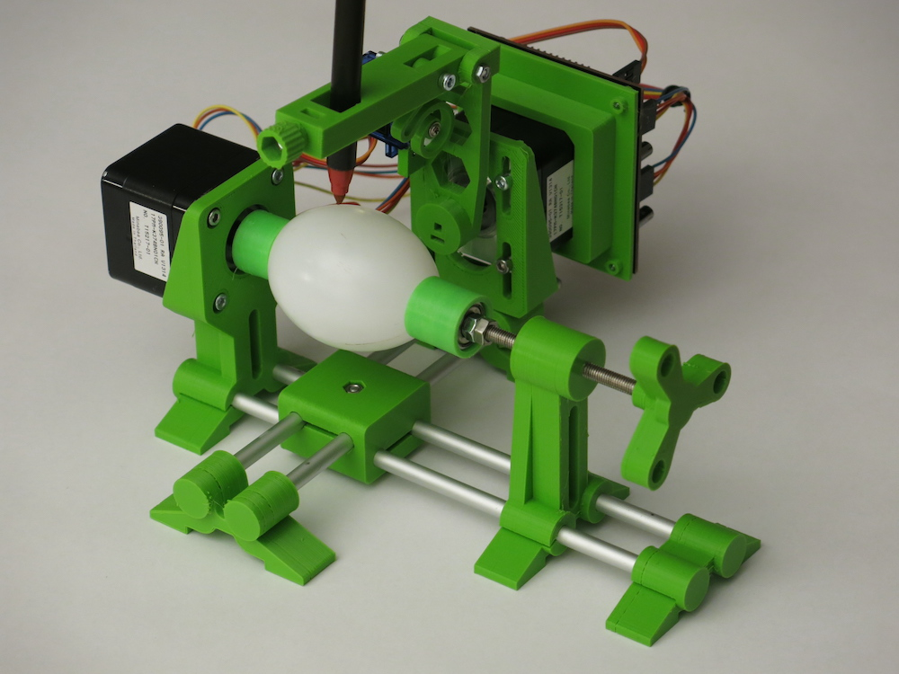

# eggbot77

Section77 variant of the EggBots with ESP32 S2 mini

* [electronic assembly instructions](./electronics/assembly/README.en.md)
* [hardware assembly](./mechanics/assembly/README.en.md)
* [inkscape plugin installation](./inkscape_1.x_extension/README.md)
