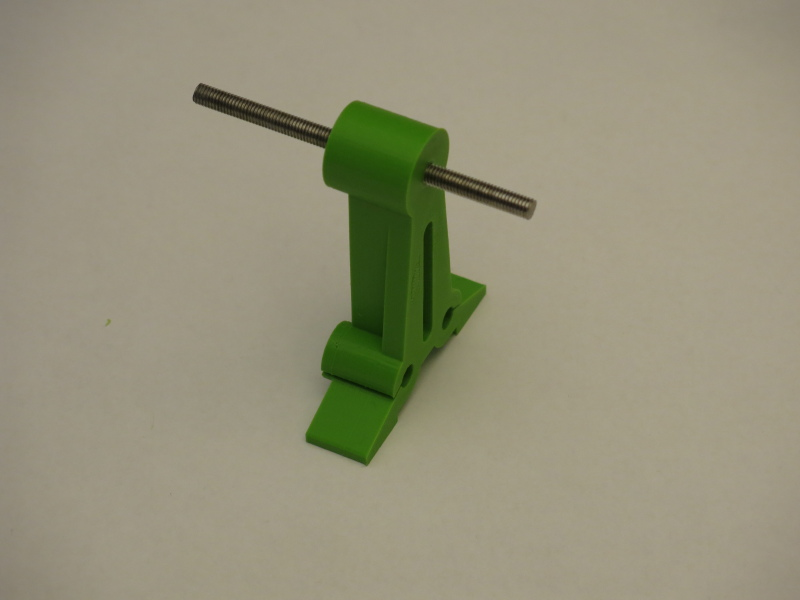
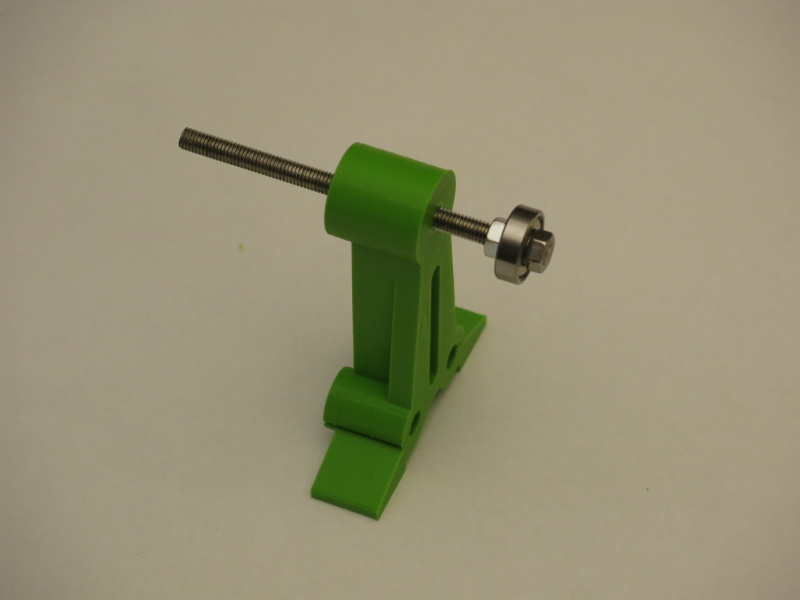
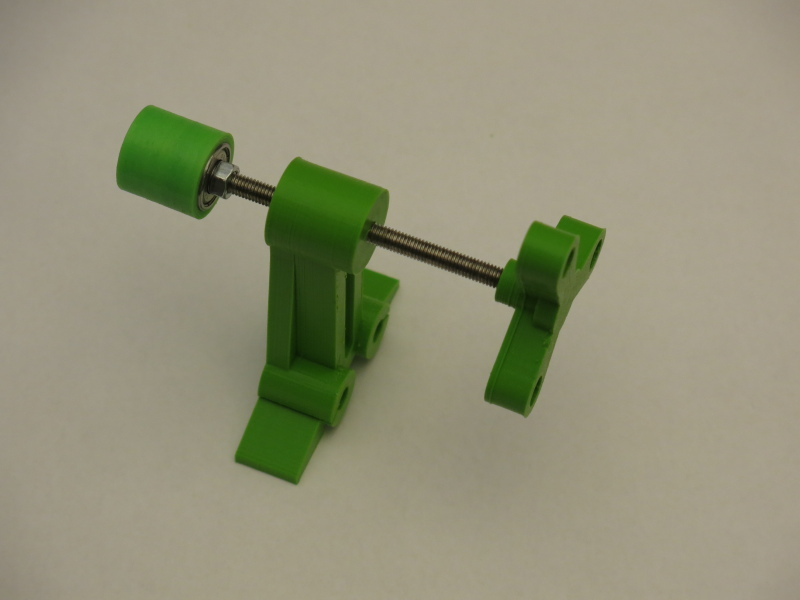
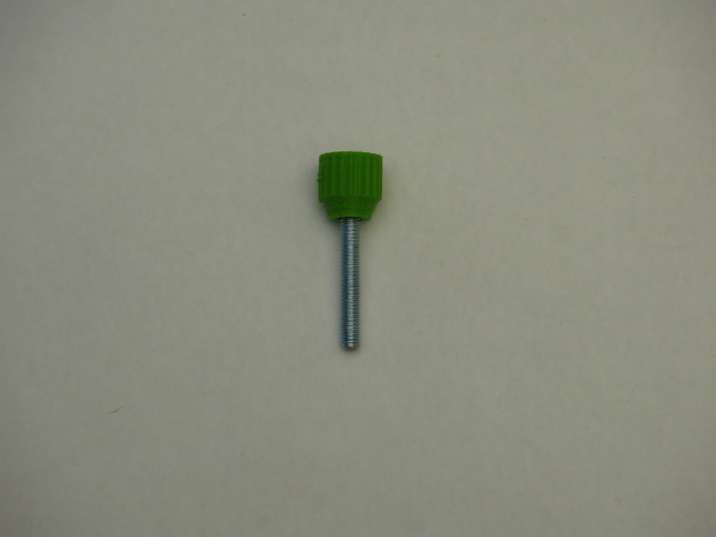
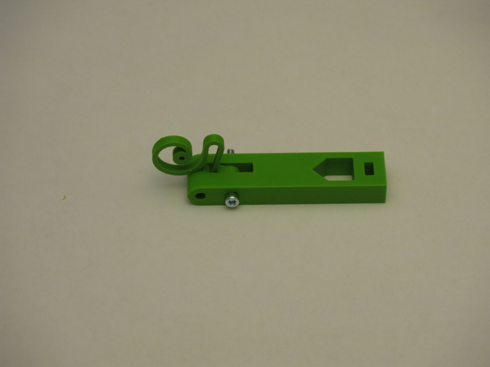
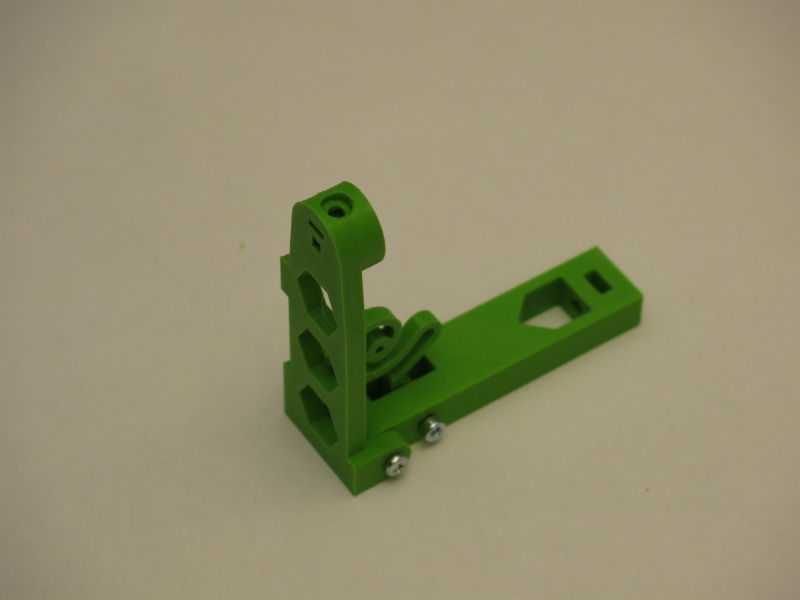

In the tradition of a popular manufacturer of kids toys located in the city Billund, Denmark (whose name we will intentionally omit here for reasons) we have divided the manual in several assembly groups:

## assembly group 1: fixation of the egg

Tools needed: TBD

Screw the threaded rod (M5) and insert it half way through the tailstock holder (aka: Bauteil 1)

Add one of the M5 nuts on the flat(!) side of the tailstock holder

Add the bearing (625ZZ) and the second of the M5 nuts to the rod.

Now only the faucet (aka: Bauteil 2) is missing - ready is your first assembly group! You're doing great! ;)

Hint: make sure the two nuts hold the bearing firmly. That will take some artistic degrees of freedom from you eggbot77, though ;)

Oh - we didn't count putting the "Eierhalter Lagerseite" (you guessed it: Bauteil 3) to the bearing.

## assembly group 2a: fixation of the pen

Don't get a drink just yet - this will be a very quick one.
Insert the M4 bolt into the nut knob (aka: Bauteil 4)

There you go - assembly group 2a is done, too!

## assembly group 2b: pen holder arm (integrates assembly group 2a)

This is going to be a bit trickier. But do not worry. You'll be fine.
Insert the M3x20 bolt through the hole in the toolmount (Bauteil 5) attaching the spring (Bauteil 6) to it.
Hints: give the picture a close look and you'll see which of the many ways this could be done is the only correct one.

Now take the M3x30 bolt to attach the penarm to the toolmount.

![](
![](
![](
![](
![](
## assembly group 3: PCB holder
![](
![](
![](
![](
![](

## complete assembly: integrates remaining single parts and all assembly groups

![](
![](
![](
![](
![](
