## eggbot77 Montageanleitung für die Mechanik

In Anlehnung an einen bekannten Hersteller von Kinderspielzeug aus der dänischen Stadt Billund (dessen Namen wir hier aus Gründen bewusst weglassen) haben wir die Anleitung in mehrere Baugruppen unterteilt:

## Montagegruppe 1: Fixierung für des Ei

Benötigte Werkzeuge: 2 Gabelschlüssel 10mm

Schraube die Gewindestange (M5) bis zur Hälfte durch den [Reitstockhalter](eb77-eh21_bauteil-01.JPG)
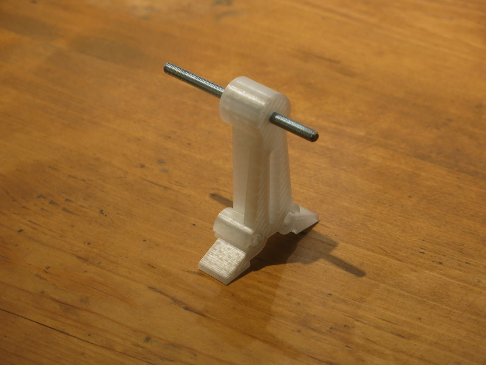

Eine der M5-Muttern auf der flachen(!) Seite des Reitstockhalters anbringen
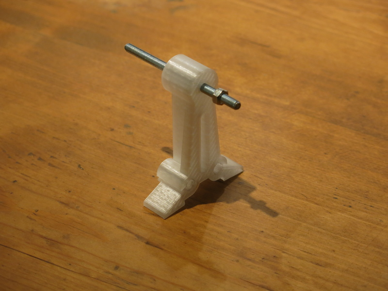

Bring' das Lager (625ZZ) und die zweite der M5-Muttern an der Stange an.
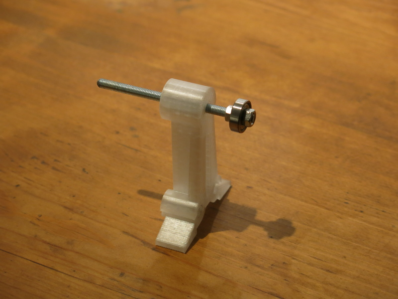

Hinweise: 
* Die zweite Mutter sollte mit dem Ende der Gewindestange bündig sein und direkt neben dem Lager, das sich neben der zuerst eingesetzten Mutter befinden sollte.
* Stell' sicher, dass die beiden Muttern das Lager festhalten. Das nimmt dem EggBot77 allerdings einige künstlerische Freiheitsgrade ;)
* Jetzt noch den [Eierhalter Lagerseite](eb77-eh21_bauteil-03-a.JPG) auf das Lager aufstecken

Jetzt fehlt nur noch der [Wasserhahn](eb77-eh21_bauteil-02.JPG) - fertig ist Deine erste Baugruppe! Das machst du toll! ;)
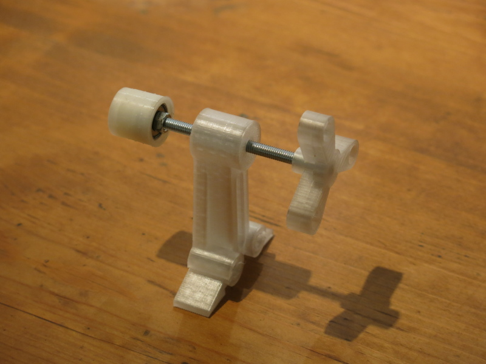

## Baugruppe 2a: Fixierung des Stiftes

Benötigte Werkzeuge: keines

Hol' Dir noch nichts zu trinken - das geht ganz schnell.
Führe die M4-Schraube in den [Griff](eb77-eh21_bauteil-04.JPG)
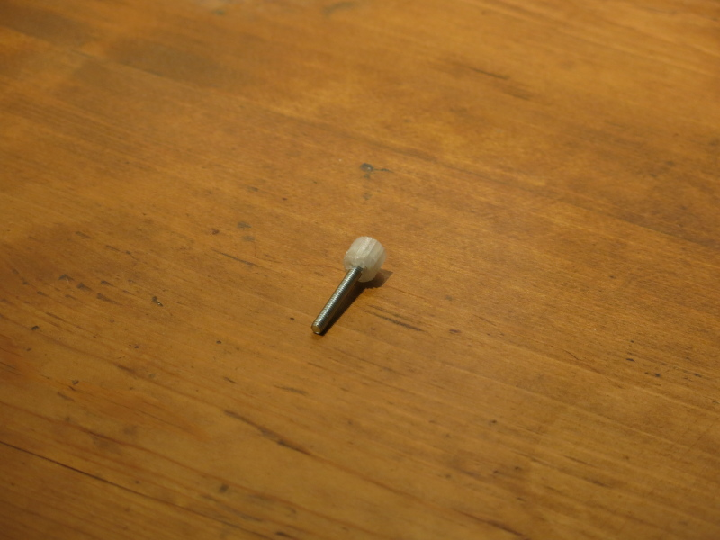

Na bitte - Baugruppe 2a ist auch fertig!

## Baugruppe 2b: Stifthalterarm (integriert Baugruppe 2a)

Benötigte Werkzeuge: Innensechskantschlüssel 2mm, Kreuzschlitzschraubendreher mittel, Kreuzschlitzschraubendreher klein (PH00)

Das wird jetzt ein bisschen kniffliger. Aber keine Sorge. Du schaffst das schon.
Stecke die Zylinderkopfschraube M3x20 durch das Loch in der [Werkzeughalterung](eb77-eh21_bauteil-05.JPG) und befestige die [Feder](eb77-eh21_bauteil-06.JPG) daran.
Hinweis: Schau' Dir das folgende Bild genau an, dann wirst Du sehen, welche der vielen Möglichkeiten die einzig richtige ist.
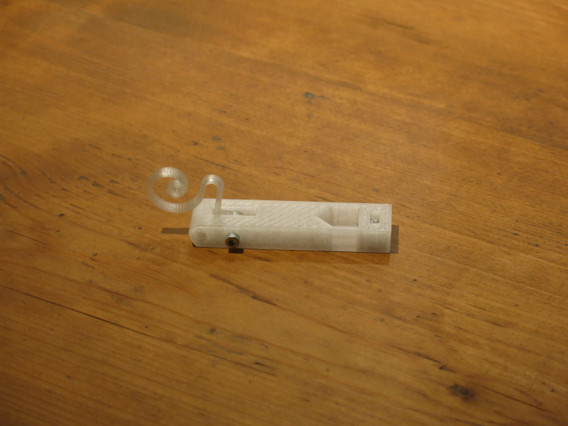

Nimm nun die M3x30-Schraube, um den [Stiftarm](eb77-eh21_bauteil-07.JPG) an der Werkzeughalterung zu befestigen.
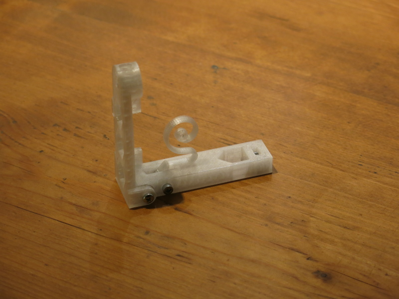

Als Nächstes setzt Du die M4-Mutter in die Aussparung der Werkzeughalterung ein und schraubst die Baugruppe 2a hinein.
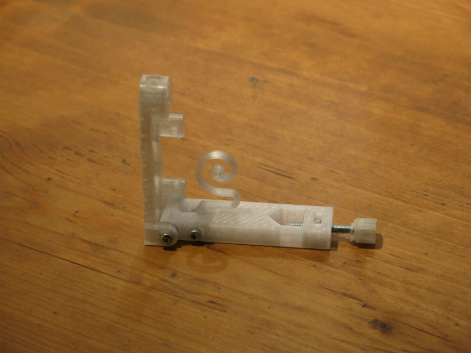

Jetzt wird es noch etwas kniffliger: Befestige das blaue Mini-Servo mit den 2 Miniaturschrauben. Setze die Schrauben von der Servoseite her ein, so dass das Ende im Stiftarm sitzt.
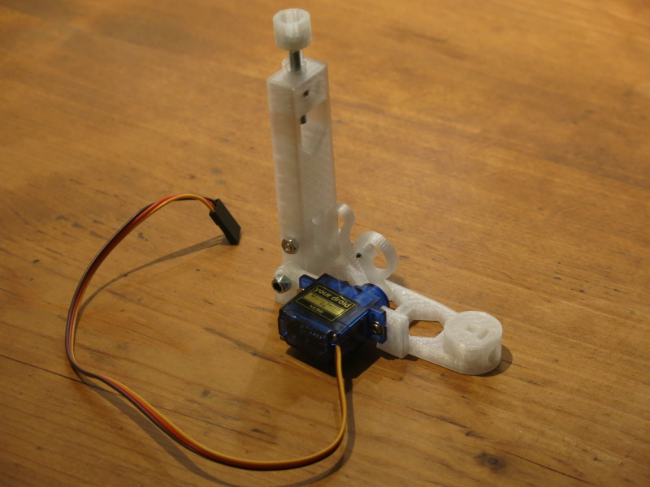

Befestige den Servoarm mit der einzelnen 3mm-Schraube.
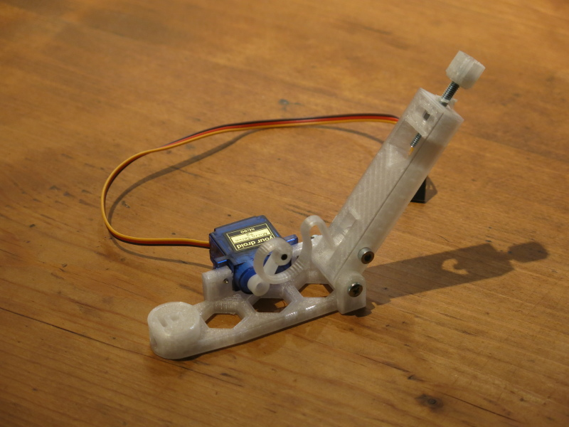

Hinweis: Möglicherweise musst Du den Winkel, in dem der Arm am Servo befestigt ist, später nachjustieren. Mach' Dir jetzt sich also nicht zu viele Gedanken darüber.

Eine weitere Spezialschraube (die kleinste Schraube, die Du als Teil des Bausatzes erhalten hast) wird das offene Ende der Feder am Servoarm befestigen. Benutze das letzte der Löcher im Inneren des Arms.

## Baugruppe 3: Platinenhalter

Benötigte Werkzeuge: Kreuzschlitzschraubendreher mittel

Das wird jetzt wieder einfach. Befestige die Platine mit den 4 3mm-Schrauben am [Platinenhalter](eb77-eh21_bauteil-08.JPG) mit den [Abstandhaltern](eb77-eh21_bauteil-09.JPG).
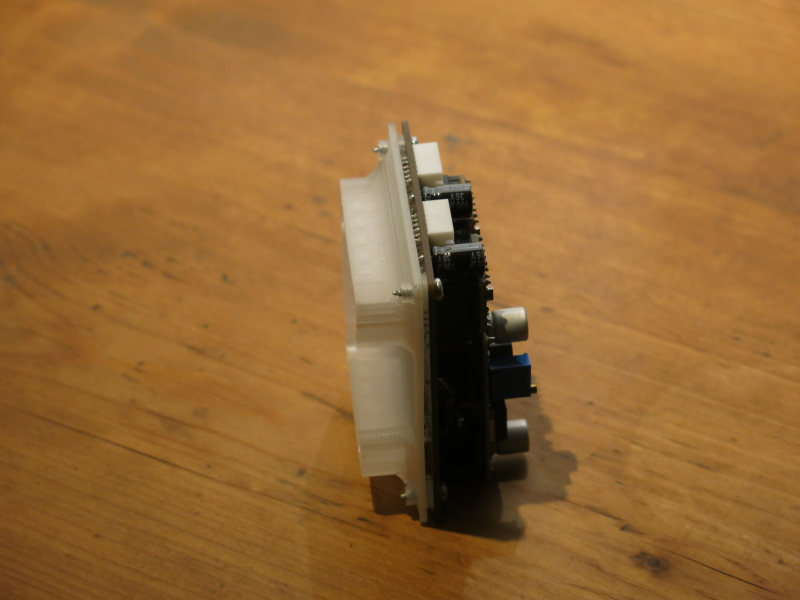
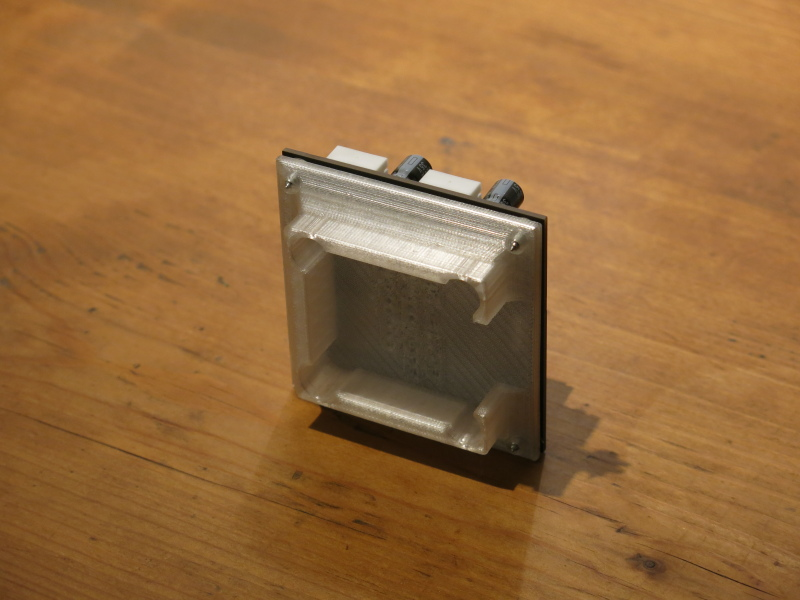

## Vollständiger Zusammenbau: integriert die restlichen Einzelteile und alle Baugruppen

Benötigte Werkzeuge: Kreuzschlitzschraubendreher mittel, Innensechskantschlüssel 2mm

Du bist nun bereit, Deinen EggBot77 zusammenzubauen! Nimm die 2 längeren (!) der 6mm Aluminiumstangen und stecke sie durch die unteren Löcher der [zentralen Box](eb77-eh21_bauteil-10.JPG). Welche ist die Unterseite der Box? Gut, dass du fragst! Das ist diejenige, die die M3-Mutter aufnimmt; die obere Seite ist also diejenige, die eine Senkbohrung für die Schraube hat. Nun nimmst du die 2 verbleibenden Stangen und steckst sie durch die restlichen Löcher der Box.
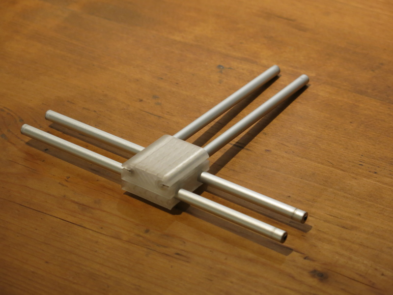

Steck' nun die M3x20 Senkkopfschraube in die Oberseite der Box und sichere sie mit der verbleibenden M3-Mutter.
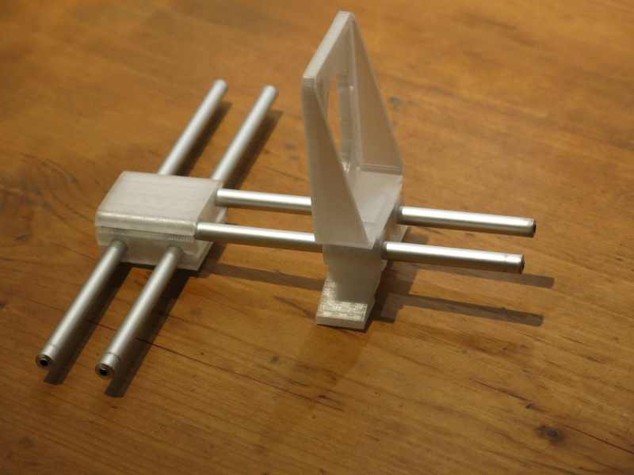

Steck' den [Stepperhalter für den Stift](eb77-eh21_bauteil-11.JPG) (leicht zu erkennen an den langen vertikalen Löchern, die eine Höhenverstellung des Steppers ermöglichen - übrigens eine der Verbesserungen des diesjährigen Modells) auf das kürzere Stangenpaar.
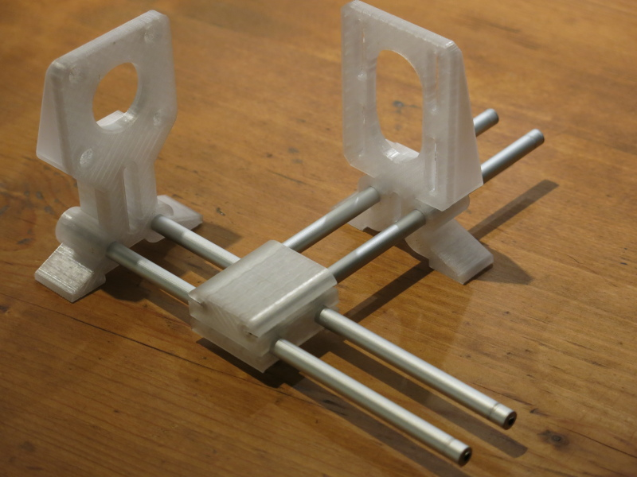

Das andere Ende dieser Stangen geht in den [Stiftstepperhalterfuß](eb77-eh21_bauteil-12.JPG).
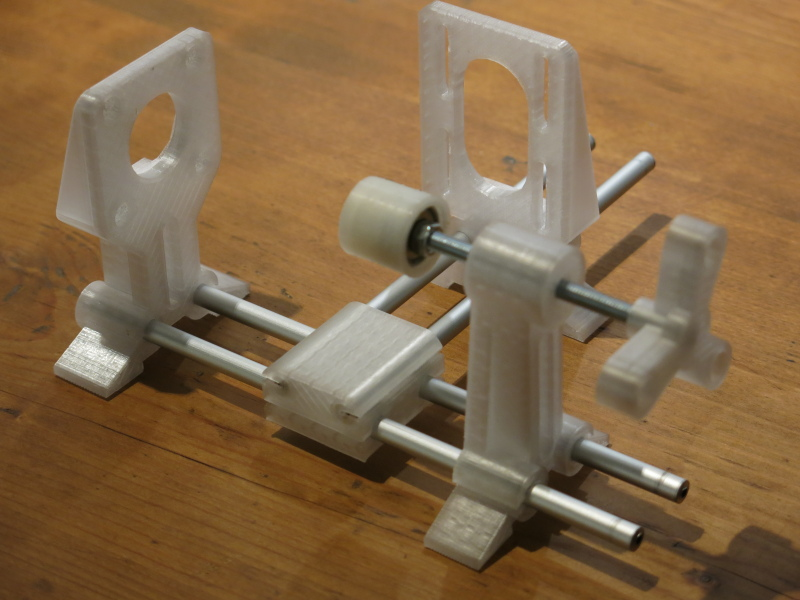

Der [Rotationsstepperhalter](eb77-eh21_bauteil-13.JPG) kommt an das linke Ende des längeren Stangenpaars; dann befindet sich der Stiftstepperhalter auf der anderen Seite des Bots. Langsam nimmt er Gestalt an, nicht wahr?
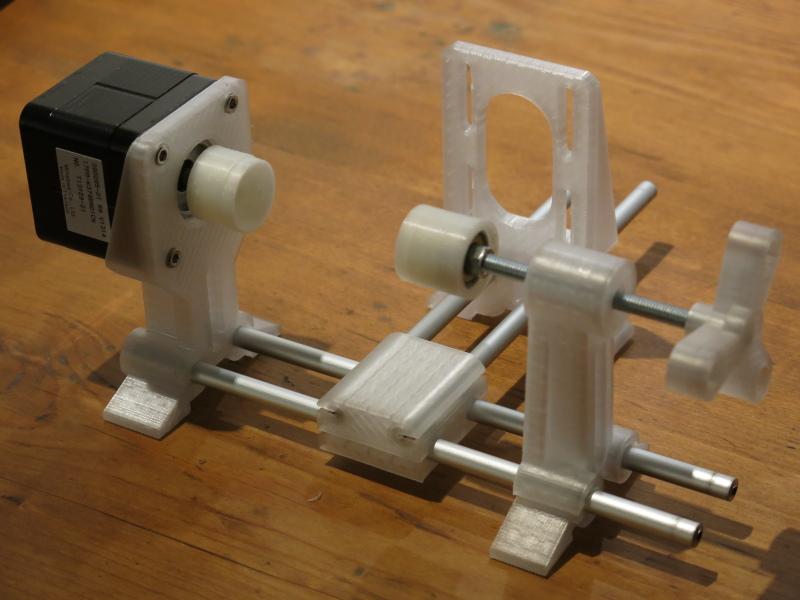

Füge nun die vormontierte [Baugruppe 1](eb77-eh22_baugruppe-1-3.JPG) und den [Rotationsschritthalterfuß](eb77-eh21_bauteil-14.JPG) auf der rechten Seite des längeren Stangenpaares hinzu.
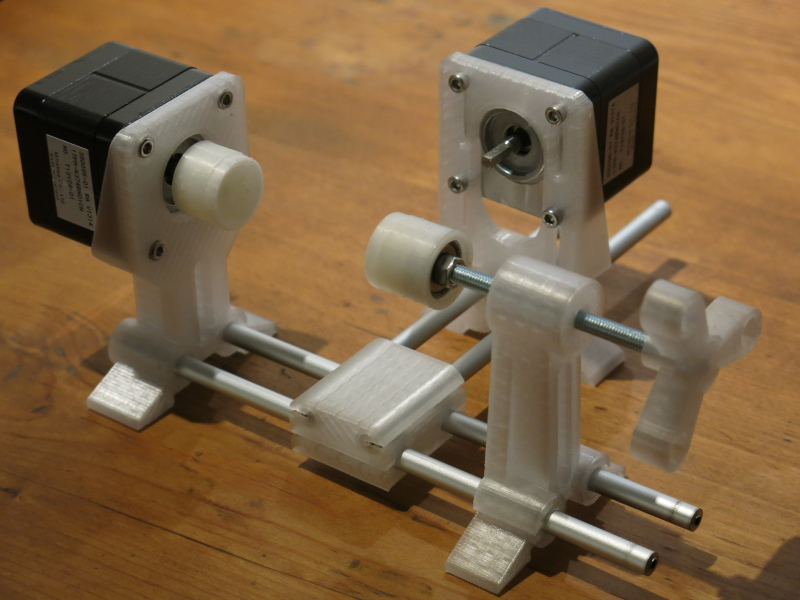

Es ist an der Zeit, den ersten Schrittmotor (achte darauf, dass Du den schwarzen nimmst) (nur ein Scherz) und den [Eierhalter für die Stiftseite](eb77-eh21_bauteil-15.JPG) hinzuzufügen.

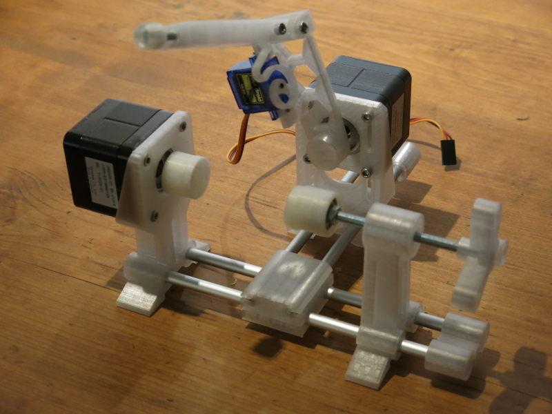

Füge jetzt den zweiten Stepper hinzu. Du kannst die Höhe später anpassen, aber fixiere ihn erst einmal irgendwo in der Mitte.
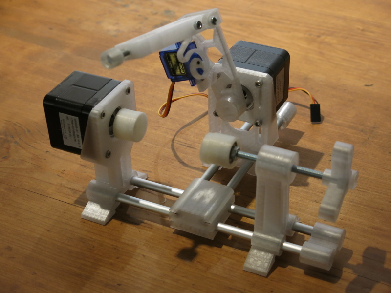

Zum Schluss fügst du die vormontierte [Baugruppe 2b](eb77-eh22_baugruppe-2b.JPG) und die [Baugruppe 3, alias: die Platine](eb77-eh22_baugruppe-3.JPG) hinzu und bist mit dem Mechanikteil fertig - Glückwunsch!

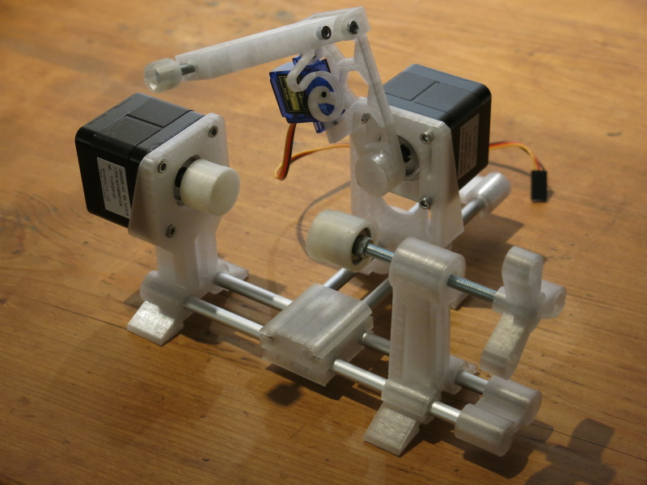
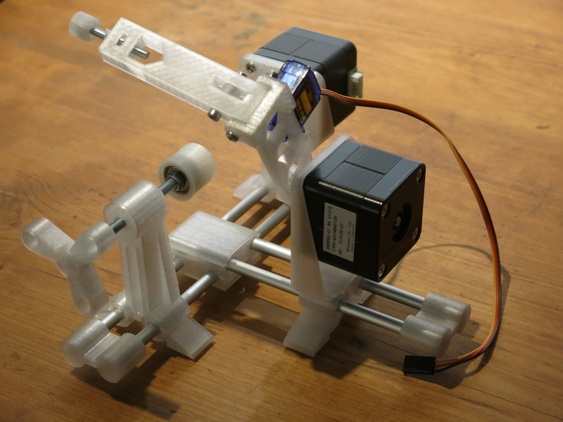
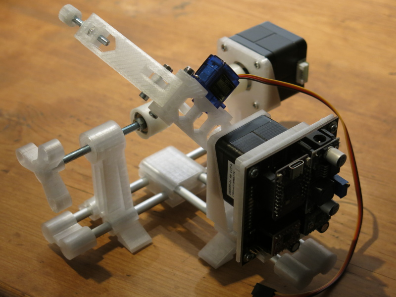
